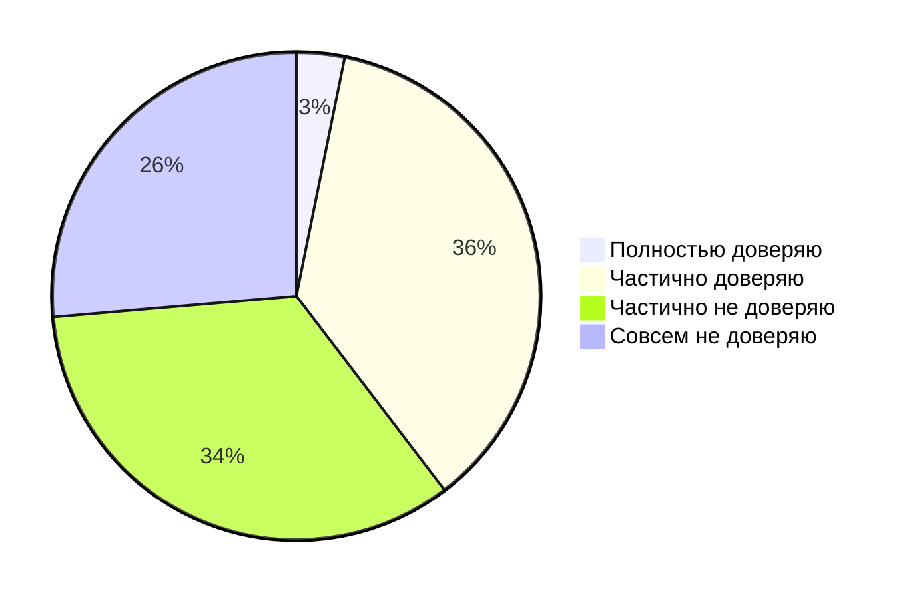

# "ИИ -- это новое электричество"

[Andrew Ng, 2017](https://www.gsb.stanford.edu/insights/andrew-ng-why-ai-new-electricity)

# 85% разработчиков регулярно используют ИИ для разработки

[Jetbrains, 2025](https://blog.jetbrains.com/research/2025/10/state-of-developer-ecosystem-2025/)

# Медианное дневное время на использование ИИ -- 2 часа

[Google, 2025](https://blog.google/technology/developers/dora-report-2025/)

# В Google 25% нового кода генерируется при помощи ИИ

[Google, 2024](https://blog.google/inside-google/message-ceo/alphabet-earnings-q3-2024/#full-stack-approach)

---
layout: default
glowSeed: 3
---

# Доверяете ли вы сгенерированному коду?

[Stackoverflow, 2025](https://survey.stackoverflow.co/2025/ai#developer-tools-ai-acc-prof-exp)

---
layout: two-cols
---

::right::

# Google считает автодополнение как сгенерированный текст[^*]

[^*]: [LinkedIn](https://www.linkedin.com/posts/andriyburkov_more-context-on-how-25-of-all-the-code-is-activity-7258621398401585153-20dZ)

---
layout: default
---

# Исследование по времени ускорения работы[^*]

## Исходные данные

- Начало 2025 года
- AI инструменты (Cursor Pro, Claude Sonnet)
- 16 разработчиков
- 246 задач

## Ощущения

- стали продуктивнее на 20%

## Реальность

- Время выполнения задач увеличилось на 19%

[^*]: [Measuring the Impact of Early-2025 AI on Experienced Open-Source Developer Productivity](https://arxiv.org/abs/2507.09089)

---
preload: false
---

# Промежуточные выводы об ИИ в разработке

<v-clicks>
  

    

      

    

    

      Потенциально ускоряет разработку
    

  

  

    

      

    

    

      Уменьшает когнитивную нагрузку
    

  

  

    

      

    

    

      Упрощает доступность технологий
    

  

  

    

      

    

    

      Код требует проверки
    

  

  

    

      

    

    

      Юридические опасения
    

  

</v-clicks>

<!--
Потенциально ускоряет разработку ПО за счет автоматизации рутинных задач и автогенерации кода, позволяя разработчикам сосредоточиться на сложных аспектах работыtranslate:.

    Уменьшает когнитивную нагрузку, помогая анализировать большие объемы данных и находить ошибки в коде, что повышает качество и точность программных продуктовtranslate:.

    Упрощает доступность технологий и ускоряет обучение, предоставляя решения, объяснения и обратную связь в реальном времени, особенно полезно для новичковtranslate:.

    Ограниченный контроль и необходимость постоянной проверки: ИИ генерирует код, который требует тщательной проверки, поскольку ошибки и непредсказуемые решения могут создавать проблемы, а также есть риск утраты профессиональных навыков при чрезмерном использованииtranslate:.

    Проблемы с доверием и ответственностью: многие разработчики не доверяют ИИ полностью, а также остаётся неясным вопрос принадлежности AI-сгенерированного кода и возможных юридических рисков использования чужих решенийtranslate:.
-->
