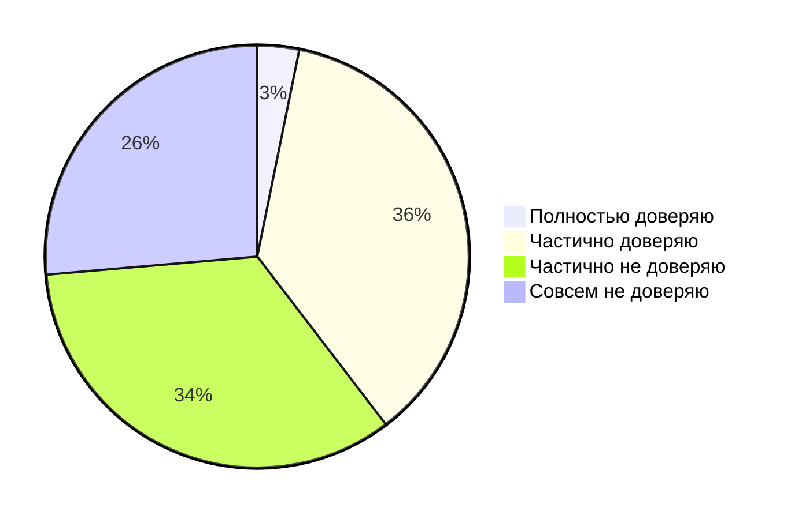

# "ИИ -- это новое электричество"

[Andrew Ng, 2017](https://www.gsb.stanford.edu/insights/andrew-ng-why-ai-new-electricity)

# 85% разработчиков регулярно используют ИИ для разработки

[Jetbrains, 2025](https://blog.jetbrains.com/research/2025/10/state-of-developer-ecosystem-2025/)

# Медианное дневное время на использование ИИ -- 2 часа

[Google, 2025](https://blog.google/technology/developers/dora-report-2025/)

# В Google 25% нового кода генерируется при помощи ИИ

[Google, 2024](https://blog.google/inside-google/message-ceo/alphabet-earnings-q3-2024/#full-stack-approach)

<!--
Пойдем с самого начала, с огромного хайпа, ажиотажа вокруг использования ИИ в разработке. 
Например, называют ИИ новым электричеством, исследования этого года показывают, что 25% нового кода генерируется с помощью ИИ, 
и тратится на это два часа в день
-->

---
layout: default
glowSeed: 3
---

# Доверяете ли вы сгенерированному коду?

[Stackoverflow, 2025](https://survey.stackoverflow.co/2025/ai#developer-tools-ai-acc-prof-exp)

<!--
И тут я предлагаю сразу навернуть бочку дёгтя: если взглянуть на диаграмму опроса StackOverflow, окажется, что только 2.5% доверяют целиком сгенерированному коду, видно, что разработчики с крайней опаской смотрят на эти новые ворота.
-->

---
layout: two-cols
---

::right::

# Google считает автодополнение как сгенерированный текст[^*]

[^*]: [LinkedIn](https://www.linkedin.com/posts/andriyburkov_more-context-on-how-25-of-all-the-code-is-activity-7258621398401585153-20dZ)

<!--
А вот если копнуть ещё глубже, то окажется, что те самые 25% "сгенерированного" кода в гугле это автодополнение в большинстве случаев
-->

---
layout: default
---

# Исследование по ускорению времени работы[^*]

## Исходные данные

- Начало 2025 года
- AI инструменты (Cursor Pro, Claude Sonnet)
- 16 разработчиков
- 246 задач

<v-click>

## Ощущения

- стали продуктивнее на 20%

</v-click>

<v-click>

## Реальность

- Время выполнения задач увеличилось на 19%

</v-click>

[^*]: [Measuring the Impact of Early-2025 AI on Experienced Open-Source Developer Productivity](https://arxiv.org/abs/2507.09089)

<!--
Ещё интереснее, провели первые эксперименты по замеру времени работы с AI-помощником. По ощущениям [click] +20%. Круто! По секундомеру [click] замедлились на 19%.
Да, тут выборка очень маленькая и много вопросов к качеству обучения сотрудников перед использованием такого инструмента, но заставляет задуматься.
-->

---
preload: false
---

# Промежуточные выводы об ИИ в разработке

<v-clicks>
  

    

      

    

    

      Потенциально ускоряет разработку
    

  

  

    

      

    

    

      Уменьшает когнитивную нагрузку
    

  

  

    

      

    

    

      Упрощает доступность технологий
    

  

  

    

      

    

    

      Код требует проверки
    

  

  

    

      

    

    

      Юридические опасения
    

  

</v-clicks>

<!--
Что можно зафиксировать к этому моменту: ИИ ускоряет разработку, но это неточно [click], 
очевидно разгружает мозг [click], 
упрощает не жизнь, но доступ к технологиям [click], 
но этому сгенерированному коду не доверяют [click],
и очень многие боятся юридических последствий [click] вдруг сгенерированный код основан на чьём-то закрытом коде,
-->
