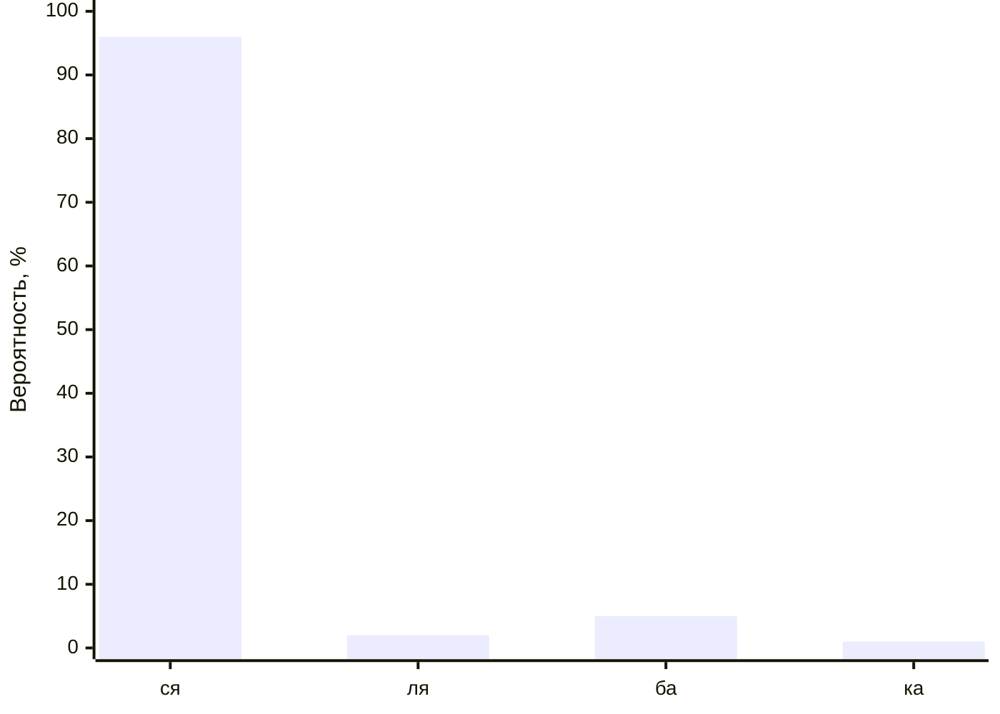

# Как работает LLM

<div class="grid grid-cols-[25%_5%_40%_5%_25%] gap-4 items-center justify-center h-[80%] min-h-80">
    <div class="grid grid-cols-[75%_25%] gap-0 h-[100%] min-h-80">
        <div v-click.at="+4" class="flex flex-col h-full">
            <div class="flex-1 border-2 border-gray-300 p-2 flex items-center justify-center">Запрос (prompt)</div>
        </div>
        <div v-click.at="+3" class="border-2">
            <div class="transform rotate-270 flex flex-col justify-center text-4xl h-[110%]">
                <div class="w-full">ТЕКСТ</div>
            </div>
        </div>
    </div>
    <div v-click.at="+2">
        <div i-carbon:arrow-right text-6xl />
    </div>
    <div v-click.at="+1">
        <div i-carbon:model h-95 w-95 class="text-center"/>
    </div>
    <div v-click.at="+2">
        <div i-carbon:arrow-right text-6xl />
    </div>
    <div class="grid grid-cols-[25%_75%] gap-0 h-[100%] min-h-80">
        <div v-click.at="+3" class="border-2">
            <div class="transform rotate-270 flex flex-col justify-center text-4xl h-[110%]">
                <div class="w-full">ТЕКСТ</div>
            </div>
        </div>
        <div v-click.at="+4" class="flex flex-col h-full">
            <div class="flex-1 border-2 border-gray-300 p-2 flex items-center justify-center">Ответ</div>
        </div>
    </div>
</div>

---
layout: image
image: "/pages/include/chatgpt-1.png"
backgroundSize: contain
---

---
layout: image
image: "/pages/include/chatgpt-2.png"
backgroundSize: contain
---

---
layout: two-cols-header
---

# Как работает LLM

<span>Контекст, что ты такое?</span>

::left::

## Запрос #1

```
Q: крутится ли воздух внутри колеса?
```

## Ответ #1

```
A: крутится конечно, чего бы ему не крутиться
```

::right::

## Запрос #2

```
<context>
Q: крутится ли воздух внутри колеса?
A: крутится конечно, чего бы ему не крутиться
</context>
Q: а может, не крутится?
```

## Ответ #2

```
A: может и не крутится, с чего бы ему крутиться
```

---

# Как работает LLM

<div v-if="1" class="grid grid-cols-[25%_5%_40%_5%_25%] gap-4 items-center justify-center h-[80%] min-h-80">
    <div class="grid grid-cols-[75%_25%] gap-0 h-[100%] min-h-80">
        <div class="flex flex-col h-full">
            <div class="flex-1 border-2 border-gray-300 p-2 flex items-center justify-center">Запрос (prompt)</div>
        </div>
        <div class="border-2">
            <div class="transform rotate-270 flex flex-col justify-center text-4xl h-[110%]">
                <div class="w-full">ТЕКСТ</div>
            </div>
        </div>
    </div>
    <div>
        <div i-carbon:arrow-right text-6xl />
    </div>
    <div>
        <div i-carbon:model h-95 w-95 class="text-center"/>
    </div>
    <div>
        <div i-carbon:arrow-right text-6xl />
    </div>
    <div class="grid grid-cols-[25%_75%] gap-0 h-[100%] min-h-80">
        <div class="border-2">
            <div class="transform rotate-270 flex flex-col justify-center text-4xl h-[110%]">
                <div class="w-full">ТЕКСТ</div>
            </div>
        </div>
        <div class="flex flex-col h-full">
            <div class="flex-1 border-2 border-gray-300 p-2 flex items-center justify-center">Ответ</div>
        </div>
    </div>
</div>

---

# Как работает LLM

<div v-if="1" class="grid grid-cols-[25%_5%_40%_5%_25%] gap-4 items-center justify-center h-[80%] min-h-80">
    <div class="grid grid-cols-[75%_25%] gap-0 h-[100%] min-h-80">
        <div class="flex flex-col h-full">
            <div class="flex-1 border-2 border-gray-300 p-2 flex items-center justify-center">Запрос (prompt)</div>
            <div class="flex-1 text-red border-2 border-red-300 p-2 flex items-center justify-center">Контекст</div>
        </div>
        <div class="border-2">
            <div class="transform rotate-270 flex flex-col justify-center text-4xl h-[110%]">
                <div class="w-full">ТЕКСТ</div>
            </div>
        </div>
    </div>
    <div>
        <div i-carbon:arrow-right text-6xl />
    </div>
    <div>
        <div i-carbon:model h-95 w-95 class="text-center"/>
    </div>
    <div>
        <div i-carbon:arrow-right text-6xl />
    </div>
    <div class="grid grid-cols-[25%_75%] gap-0 h-[100%] min-h-80">
        <div class="border-2">
            <div class="transform rotate-270 flex flex-col justify-center text-4xl h-[110%]">
                <div class="w-full">ТЕКСТ</div>
            </div>
        </div>
        <div class="flex flex-col h-full">
            <div class="flex-1 border-2 border-gray-300 p-2 flex items-center justify-center">Ответ</div>
        </div>
    </div>
</div>

<v-click at="1">
    <Arrow 
        text-red x1="250" 
        y1="100" 
        x2="250" 
        y2="470" 
        two-way="true"
        v-motion
        :initial="{ x: -20, opacity: 0}"
        :enter="{ x: 0, opacity: 1, transition: { delay: 0, duration: 1000 } }"
    />
    <div
        class="text-1xl absolute top-22 left-65 text-red"
        v-motion
        :initial="{ x: -40, opacity: 0}"
        :enter="{ x: 0, opacity: 1, transition: { delay: 500, duration: 1000 } }">
        Контекстное окно
    </div>
</v-click>

---

# Как работает LLM

<span>Токены и с чем их едят</span>

## Английский язык

<span class="tokenizer-tkn bg-[#e9950c]">Many</span><span class="tokenizer-tkn bg-[#2e95d3]"> words</span><span class="tokenizer-tkn bg-[#00a67d]"> map</span><span class="tokenizer-tkn bg-[#df3079]"> to</span><span class="tokenizer-tkn bg-[#f22c3d]"> one</span><span class="tokenizer-tkn bg-[#e9950c]"> token</span><span class="tokenizer-tkn bg-[#2e95d3]">,</span><span class="tokenizer-tkn bg-[#00a67d]"> but</span><span class="tokenizer-tkn bg-[#df3079]"> some</span><span class="tokenizer-tkn bg-[#f22c3d]"> don't</span><span class="tokenizer-tkn bg-[#e9950c]">:</span><span class="tokenizer-tkn bg-[#2e95d3]"> indiv</span><span class="tokenizer-tkn bg-[#00a67d]">isible</span><span><span class="tokenizer-tkn bg-[#df3079]">.</span><br><br></span><span class="tokenizer-tkn bg-[#f22c3d]">Unicode</span><span class="tokenizer-tkn bg-[#e9950c]"> characters</span><span class="tokenizer-tkn bg-[#2e95d3]"> like</span><span class="tokenizer-tkn bg-[#00a67d]"> emojis</span><span class="tokenizer-tkn bg-[#df3079]"> may</span><span class="tokenizer-tkn bg-[#f22c3d]"> be</span><span class="tokenizer-tkn bg-[#e9950c]"> split</span><span class="tokenizer-tkn bg-[#2e95d3]"> into</span><span class="tokenizer-tkn bg-[#00a67d]"> many</span><span class="tokenizer-tkn bg-[#df3079]"> tokens</span><span class="tokenizer-tkn bg-[#f22c3d]"> containing</span><span class="tokenizer-tkn bg-[#e9950c]"> the</span><span class="tokenizer-tkn bg-[#2e95d3]"> underlying</span><span class="tokenizer-tkn bg-[#00a67d]"> bytes</span><span class="tokenizer-tkn bg-[#df3079]">:</span><span class="tokenizer-tkn bg-[#f22c3d]"> �</span><span class="tokenizer-tkn bg-[#e9950c]">�</span><span class="tokenizer-tkn bg-[#2e95d3]">�</span><span class="tokenizer-tkn bg-[#00a67d]">�</span><span><br><br></span><span class="tokenizer-tkn bg-[#f22c3d]">Sequences</span><span class="tokenizer-tkn bg-[#e9950c]"> of</span><span class="tokenizer-tkn bg-[#2e95d3]"> characters</span><span class="tokenizer-tkn bg-[#00a67d]"> commonly</span><span class="tokenizer-tkn bg-[#df3079]"> found</span><span class="tokenizer-tkn bg-[#f22c3d]"> next</span><span class="tokenizer-tkn bg-[#e9950c]"> to</span><span class="tokenizer-tkn bg-[#2e95d3]"> each</span><span class="tokenizer-tkn bg-[#00a67d]"> other</span><span class="tokenizer-tkn bg-[#df3079]"> may</span><span class="tokenizer-tkn bg-[#f22c3d]"> be</span><span class="tokenizer-tkn bg-[#e9950c]"> grouped</span><span class="tokenizer-tkn bg-[#2e95d3]"> together</span><span class="tokenizer-tkn bg-[#00a67d]">:</span><span class="tokenizer-tkn bg-[#df3079]"> </span><span class="tokenizer-tkn bg-[#f22c3d]">123</span><span class="tokenizer-tkn bg-[#e9950c]">456</span><span class="tokenizer-tkn bg-[#2e95d3]">789</span><span class="tokenizer-tkn bg-[#00a67d]">0</span>

## Русский язык

<span class="tokenizer-tkn bg-[#e9950c]">Р</span><span class="tokenizer-tkn bg-[#2e95d3]">анее</span><span class="tokenizer-tkn bg-[#00a67d]"> в</span><span class="tokenizer-tkn bg-[#df3079]"> русском</span><span class="tokenizer-tkn bg-[#f22c3d]"> языке</span><span class="tokenizer-tkn bg-[#e9950c]"> большинство</span><span class="tokenizer-tkn bg-[#2e95d3]"> букв</span><span class="tokenizer-tkn bg-[#00a67d]"> явля</span><span class="tokenizer-tkn bg-[#df3079]">лись</span><span class="tokenizer-tkn bg-[#f22c3d]"> отдель</span><span class="tokenizer-tkn bg-[#e9950c]">ными</span><span class="tokenizer-tkn bg-[#2e95d3]"> ток</span><span class="tokenizer-tkn bg-[#00a67d]">ен</span><span class="tokenizer-tkn bg-[#df3079]">ами</span><span class="tokenizer-tkn bg-[#f22c3d]">.</span><span class="tokenizer-tkn bg-[#e9950c]"> В</span><span class="tokenizer-tkn bg-[#2e95d3]"> современных</span><span class="tokenizer-tkn bg-[#00a67d]"> модел</span><span class="tokenizer-tkn bg-[#df3079]">ях</span><span class="tokenizer-tkn bg-[#f22c3d]"> раз</span><span class="tokenizer-tkn bg-[#e9950c]">ницы</span><span class="tokenizer-tkn bg-[#2e95d3]"> в</span><span class="tokenizer-tkn bg-[#00a67d]"> количестве</span><span class="tokenizer-tkn bg-[#df3079]"> ток</span><span class="tokenizer-tkn bg-[#f22c3d]">ен</span><span class="tokenizer-tkn bg-[#e9950c]">ов</span><span class="tokenizer-tkn bg-[#2e95d3]"> практически</span><span class="tokenizer-tkn bg-[#00a67d]"> нет</span><span class="tokenizer-tkn bg-[#df3079]">.</span>

---

# Как работает LLM

<div v-if="1" class="grid grid-cols-[25%_5%_40%_5%_25%] gap-4 items-center justify-center h-[80%] min-h-80">
    <div class="grid grid-cols-[75%_25%] gap-0 h-[100%] min-h-80">
        <div class="flex flex-col h-full">
            <div class="flex-1 border-2 border-gray-300 p-2 flex items-center justify-center">Запрос (prompt)</div>
            <div class="flex-1 border-2 border-gray-300 p-2 flex items-center justify-center">Контекст</div>
        </div>
        <div class="border-2">
            <div class="transform rotate-270 flex flex-col justify-center text-4xl h-[120%]">
                <div class="w-full text-red">ТОКЕНЫ</div>
            </div>
        </div>
    </div>
    <div>
        <div i-carbon:arrow-right text-6xl />
    </div>
    <div>
        <div i-carbon:model h-95 w-95 class="text-center"/>
    </div>
    <div>
        <div i-carbon:arrow-right text-6xl />
    </div>
    <div class="grid grid-cols-[25%_75%] gap-0 h-[100%] min-h-80">
        <div class="border-2">
            <div class="transform rotate-270 flex flex-col justify-center text-4xl h-[110%]">
                <div class="w-full">ТЕКСТ</div>
            </div>
        </div>
        <div class="flex flex-col h-full">
            <div class="flex-1 border-2 border-gray-300 p-2 flex items-center justify-center">Ответ</div>
        </div>
    </div>
</div>

---
layout: quote
---

# Как работает LLM

<span>Последовательная генерация токенов</span>

<TypewriterText text="Если Вы когда-либо общались с ИИ-чатами, то замечали, что текст выводится последовательно. На самом деле, это происходит потому, что ответ генерируется и отображается по частям — так называемыми токенами — в режиме потоковой передачи (streaming). Каждый токен (чаще всего это слово, подслово или знак препинания) появляется на экране сразу после того, как модель его сгенерировала, не дожидаясь завершения всего ответа. Такой подход не только ускоряет восприятие ответа, но и создаёт эффект живого диалога, будто собеседник думает и говорит в реальном времени. Кроме того, постепенное появление текста снижает когнитивную нагрузку и делает взаимодействие с ИИ более естественным и интуитивным." />

---
layout: two-cols
---

# Как работает LLM

<div text-3xl italic> Напиши стихотворение:</div>

<div text-3xl italic> Жили у бабуси...</div>

<br>
<br>
<br>
<v-click at="7">

</v-click>

::right::

<div
  v-motion
  :initial="{ x: 100, y: 0 }"
  :click-1="{ x: -250, y: 190 }"
  text-5 
  absolute top-9 right-33 left-192
  class="border border-solid rounded-md px-2 py-0.5 mr-3"
>
  жили
</div>

<div
  v-motion
  :initial="{ x: 100, y: 2 }"
  :click-2="{ x: 100, y: 80 }"
  text-5 
  absolute top-37 right-107 left-128
  class="border border-solid rounded-md px-2 py-0.5 mr-3"
>
  у
</div>

<div
  v-motion
  :initial="{ x: 100, y: 1 }"
  :click-3="{ x: 280, y: 134 }"
  text-5 
  absolute top-23 right-123 left-97
  class="border border-solid rounded-md px-2 py-0.5 mr-3"
>
  бабуси
</div>

<div
  v-motion
  :initial="{ x: 100, y: 0 }"
  :click-4="{ x: 0, y: 250 }"
  text-5 
  absolute top-9 right-99 left-129
  class="border border-solid rounded-md px-2 py-0.5 mr-3"
>
  два
</div>

<div
  v-motion
  :initial="{ x: 100, y: 2 }"
  :click-5="{ x: -100, y: 138 }"
  text-5 
  absolute top-37 right-40 left-178
  class="border border-solid rounded-md px-2 py-0.5 mr-3"
>
  весёлых
</div>

<div
  v-motion
  :initial="{ x: 100, y: 2 }"
  :click-6="{ x: 95, y: 138 }"
  text-5 
  absolute top-37 right-67 left-161
  class="border border-solid rounded-md px-2 py-0.5 mr-3"
>
  гуся
</div>

<div>
    <span text-5 class="border border-solid rounded-md px-2 py-0.5 mr-3">миллионы</span>
    <span text-5 class="px-6.5 py-0.5 mr-3"></span>
    <span text-5 class="border border-solid rounded-md px-2 py-0.5 mr-3">три</span>
    <span text-5 class="border border-solid rounded-md px-2 py-0.5 mr-3">квартиры</span>
    <br>
    <br>
    <span text-5 class="px-10.5 py-0.5 mr-3"></span>
    <span text-5 class="border border-solid rounded-md px-2 py-0.5 mr-3">реституция</span>
    <span text-5 class="border border-solid rounded-md px-2 py-0.5 mr-3">деньги</span>
    <span text-5 class="border border-solid rounded-md px-2 py-0.5 mr-3">вернули</span>
    <br>
    <br>
    <span text-5 class="border border-solid rounded-md px-2 py-0.5 mr-3">обманули</span>
    <span text-5 class="px-3 py-0.5 mr-3"></span>
    <span text-5 class="border border-solid rounded-md px-2 py-0.5 mr-3">собаки</span>
    <span text-5 class="px-2 py-0.5 mr-3"></span>
    <span text-5 class="px-9 py-0.5 mr-3"></span>

</div>
<br>
<br>

<div text-4xl>___________________</div>
<div text-3><br></div>
<div text-4xl>___________________</div>
<div text-3><br></div>
<div text-4xl>___________________</div>
<div text-3><br></div>
<div text-4xl>___________________</div>

---

# Как работает LLM

Жили у бабуси два весёлых гу-

<div class="flex flex-col items-center justify-center p-20">
<div class="scale-175">

</div>
</div>


---
addons:
  - fancy-arrow
---

# Как работает LLM

<div v-if="1" class="grid grid-cols-[25%_5%_40%_5%_25%] gap-4 items-center justify-center h-[80%] min-h-80">
    <div class="grid grid-cols-[75%_25%] gap-0 h-[100%] min-h-80">
        <div class="flex flex-col h-full">
            <div class="flex-1 border-2 border-gray-300 p-2 flex items-center justify-center">Запрос (prompt)</div>
            <div class="flex-1 border-2 border-gray-300 p-2 flex items-center justify-center">Контекст</div>
            <div class="flex-1 border-2 border-gray-300 p-2 flex items-center justify-center text-red">Предыдущий вывод</div>
        </div>
        <div class="border-2">
            <div class="transform rotate-270 flex flex-col justify-center text-4xl h-[120%]">
                <div class="w-full">ТОКЕНЫ</div>
            </div>
        </div>
    </div>
    <div>
        <div i-carbon:arrow-right text-6xl />
    </div>
    <div>
        <div i-carbon:model h-95 w-95 class="text-center"/>
    </div>
    <div>
        <div i-carbon:arrow-right text-6xl />
    </div>
    <div class="grid grid-cols-[25%_75%] gap-0 h-[100%] min-h-80">
        <div class="border-2">
            <div class="transform rotate-270 flex flex-col justify-center text-4xl h-[110%]">
                <div class="w-full text-red">ТОКЕН</div>
            </div>
        </div>
        <div class="flex flex-col h-full">
            <div class="flex-1 border-2 border-gray-300 p-2 flex items-center justify-center">Ответ</div>
        </div>
    </div>
</div>

<v-click>
<FancyArrow 
from="(770, 460)" 
to="(100, 460)" 
animation-duration="1000"
animation-delay="500"
color="orange"
arc="0.1"
/>
</v-click>

---

# Промежуточные выводы

- LLM вычисляет токен за токеном
- LLM статистически подбирает слова по предыдущим + контексту
- Генерация есть перекомбинация других известных примеров
- Вероятность получить предполагаемый токен не 100%
