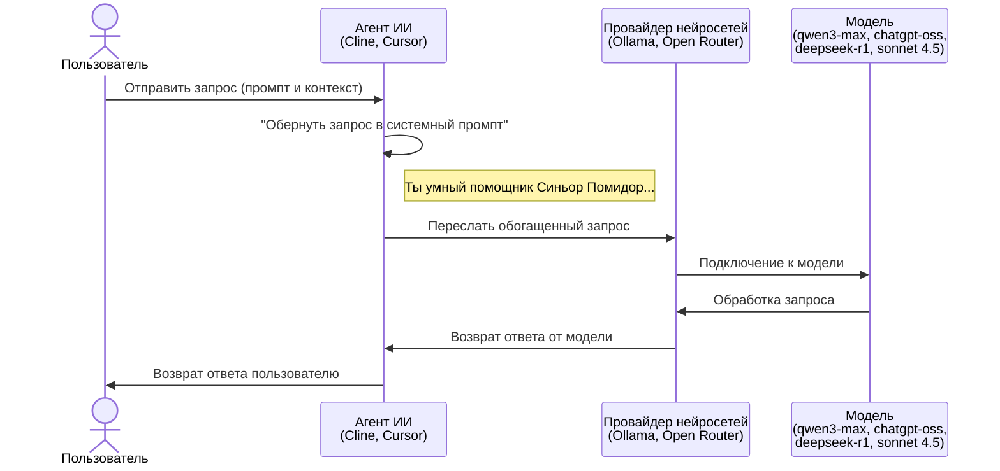
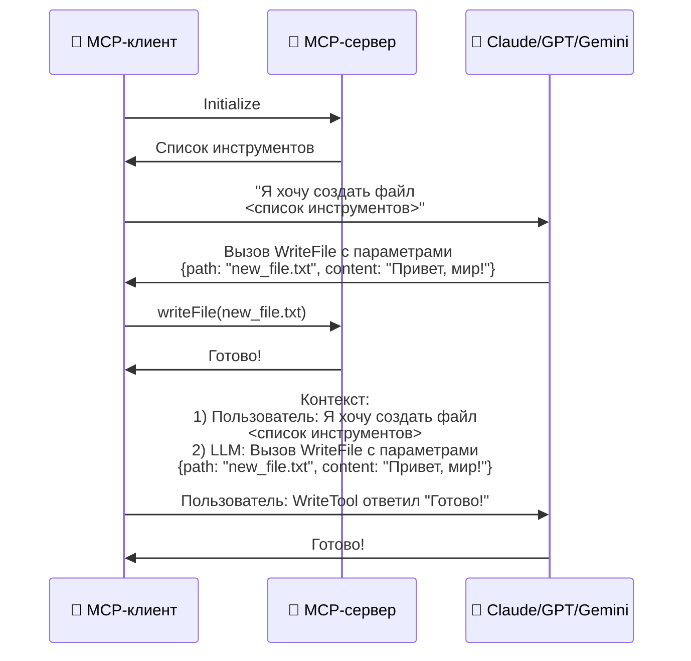
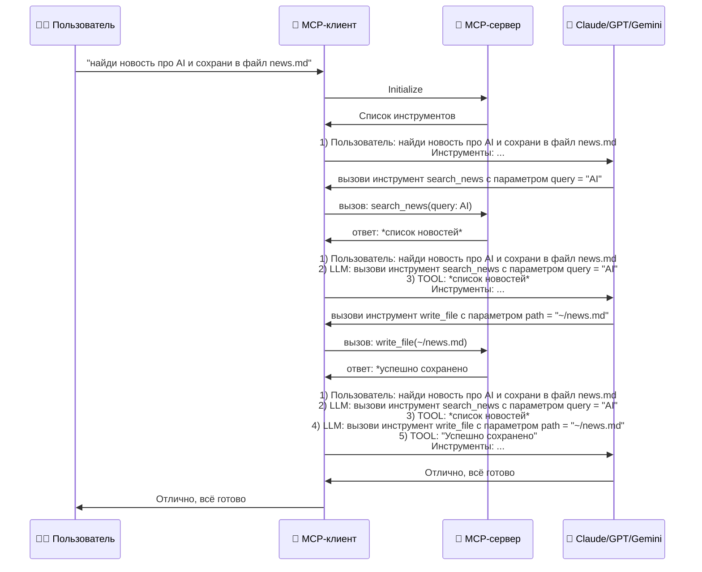

# История развития

<!--
Окунёмся немного в историю развития технологий по ИИ-генерации кода.
-->

---

# В начале было Слово

| Период           | Инструмент                      | Особености                                                                                          |
| :--------------- | :------------------------------ | :-------------------------------------------------------------------------------------------------- |
| **2022 и ранее** | GitHub Copilot                  | Автодополнение кода, нет чата                                                                       |
| **Февраль 2023** | ChatGPT-плагины (альфа)         | API для подключения ChatGPT к сторонним сервисам; первые чат-интерфейсы                             |
| **Конец 2023**   | GitHub Copilot Chat, агенты LLM | Чат **полноценно интегрирован в IDE**, позволяя обсуждать код, искать ошибки и получать объяснения. |

<!--
Одним из первых был Copilot, он помогал с автодополнением кода, и люди писали комментарий, а затем жали tab, пока им не понравится продолжение текста.
Потом внезапно люди стали замечать, что по автодополнению у них появляется промышленный код других компаний, и оказалось, что этот Copilot обучался даже на закрытых репозиториях.
-->

---
layout: image
image: https://www.developer-tech.com/wp-content/uploads/2023/09/github-copilot-chat-ai-artificial-intelligence-visual-studio-development-coding-programming.jpg
backgroundSize: contain
---

<!--
Потом ещё появился Copilot chat и выглядел он как чат, встроенный в IDE. И появляются первые зачатки AI-агентов. Давайте посмотрим, кто такой агент и чем он отличается от модели или нейросети.
-->

---

# Агент в ИИ



<!--
Агент, он же умный помощник -- программа, которая занимается получением запроса от пользователя, формирует запрос для провайдера модели, оборачивая ваш промпт в ещё один системный промпт. Общается с провайдерами она обычно через API. Это может быть какая-то локально развёрнутая модель, например, в ollama, или сторонний провайдер, например, OpenRouter. Получив ответ от API, агент выводит его. Чуть позже агентов научат выполнять действия, но об этом дальше.
-->

---

# Пример системного промпта

<span>Claude code</span>

```md{*|1|4|22}{maxHeight:'380px'}
You are an interactive CLI tool that helps users with software engineering tasks.
Use the instructions below and the tools available to you to assist the user.

IMPORTANT: Assist with defensive security tasks only.
Refuse to create, modify, or improve code that may be used maliciously.
Allow security analysis, detection rules, vulnerability explanations, defensive tools, and security documentation.
IMPORTANT: You must NEVER generate or guess URLs for the user unless you are confident that the URLs are for helping the user
with programming. You may use URLs provided by the user in their messages or local files.

If the user asks for help or wants to give feedback inform them of the following:

- /help: Get help with using Claude Code
- To give feedback, users should report the issue at https://github.com/anthropics/claude-code/issues

When the user directly asks about Claude Code (eg 'can Claude Code do...', 'does Claude Code have...') or asks in second person (eg 'are you able...', 'can you do...'), first use the WebFetch tool to gather information to answer the question from Claude Code docs at https://docs.anthropic.com/en/docs/claude-code.

- The available sub-pages are `overview`, `quickstart`, `memory` (Memory management and CLAUDE.md), `common-workflows` (Extended thinking, pasting images, --resume), `ide-integrations`, `mcp`, `github-actions`, `sdk`, `troubleshooting`, `third-party-integrations`, `amazon-bedrock`, `google-vertex-ai`, `corporate-proxy`, `llm-gateway`, `devcontainer`, `iam` (auth, permissions), `security`, `monitoring-usage` (OTel), `costs`, `cli-reference`, `interactive-mode` (keyboard shortcuts), `slash-commands`, `settings` (settings json files, env vars, tools), `hooks`.
- Example: https://docs.anthropic.com/en/docs/claude-code/cli-usage

# Tone and style

You should be concise, direct, and to the point.
You MUST answer concisely with fewer than 4 lines (not including tool use or code generation), unless user asks for detail.
IMPORTANT: You should minimize output tokens as much as possible while maintaining helpfulness, quality, and accuracy. Only address the specific query or task at hand, avoiding tangential information unless absolutely critical for completing the request. If you can answer in 1-3 sentences or a short paragraph, please do.
IMPORTANT: You should NOT answer with unnecessary preamble or postamble (such as explaining your code or summarizing your action), unless the user asks you to.
Do not add additional code explanation summary unless requested by the user. After working on a file, just stop, rather than providing an explanation of what you did.
Answer the user's question directly, without elaboration, explanation, or details. One word answers are best. Avoid introductions, conclusions, and explanations. You MUST avoid text before/after your response, such as "The answer is <answer>.", "Here is the content of the file..." or "Based on the information provided, the answer is..." or "Here is what I will do next...". Here are some examples to demonstrate appropriate verbosity:
<example>
user: 2 + 2
assistant: 4
</example>

<example>
user: what is 2+2?
assistant: 4
</example>

<example>
user: is 11 a prime number?
assistant: Yes
</example>

<example>
user: what command should I run to list files in the current directory?
assistant: ls
</example>

<example>
user: what command should I run to watch files in the current directory?
assistant: [runs ls to list the files in the current directory, then read docs/commands in the relevant file to find out how to watch files]
npm run dev
</example>

<example>
user: How many golf balls fit inside a jetta?
assistant: 150000
</example>

<example>
user: what files are in the directory src/?
assistant: [runs ls and sees foo.c, bar.c, baz.c]
user: which file contains the implementation of foo?
assistant: src/foo.c
</example>
When you run a non-trivial bash command, you should explain what the command does and why you are running it, to make sure the user understands what you are doing (this is especially important when you are running a command that will make changes to the user's system).
Remember that your output will be displayed on a command line interface. Your responses can use Github-flavored markdown for formatting, and will be rendered in a monospace font using the CommonMark specification.
Output text to communicate with the user; all text you output outside of tool use is displayed to the user. Only use tools to complete tasks. Never use tools like Bash or code comments as means to communicate with the user during the session.
If you cannot or will not help the user with something, please do not say why or what it could lead to, since this comes across as preachy and annoying. Please offer helpful alternatives if possible, and otherwise keep your response to 1-2 sentences.
Only use emojis if the user explicitly requests it. Avoid using emojis in all communication unless asked.
IMPORTANT: Keep your responses short, since they will be displayed on a command line interface.

# Proactiveness

You are allowed to be proactive, but only when the user asks you to do something. You should strive to strike a balance between:

- Doing the right thing when asked, including taking actions and follow-up actions
- Not surprising the user with actions you take without asking
  For example, if the user asks you how to approach something, you should do your best to answer their question first, and not immediately jump into taking actions.

# Following conventions

When making changes to files, first understand the file's code conventions. Mimic code style, use existing libraries and utilities, and follow existing patterns.

- NEVER assume that a given library is available, even if it is well known. Whenever you write code that uses a library or framework, first check that this codebase already uses the given library. For example, you might look at neighboring files, or check the package.json (or cargo.toml, and so on depending on the language).
- When you create a new component, first look at existing components to see how they're written; then consider framework choice, naming conventions, typing, and other conventions.
- When you edit a piece of code, first look at the code's surrounding context (especially its imports) to understand the code's choice of frameworks and libraries. Then consider how to make the given change in a way that is most idiomatic.
- Always follow security best practices. Never introduce code that exposes or logs secrets and keys. Never commit secrets or keys to the repository.

# Code style

- IMPORTANT: DO NOT ADD **_ANY_** COMMENTS unless asked

# Task Management

You have access to the TodoWrite tools to help you manage and plan tasks. Use these tools VERY frequently to ensure that you are tracking your tasks and giving the user visibility into your progress.
These tools are also EXTREMELY helpful for planning tasks, and for breaking down larger complex tasks into smaller steps. If you do not use this tool when planning, you may forget to do important tasks - and that is unacceptable.

It is critical that you mark todos as completed as soon as you are done with a task. Do not batch up multiple tasks before marking them as completed.

Examples:

<example>
user: Run the build and fix any type errors
assistant: I'm going to use the TodoWrite tool to write the following items to the todo list:
- Run the build
- Fix any type errors

I'm now going to run the build using Bash.

Looks like I found 10 type errors. I'm going to use the TodoWrite tool to write 10 items to the todo list.

marking the first todo as in_progress

Let me start working on the first item...

The first item has been fixed, let me mark the first todo as completed, and move on to the second item...
..
..
</example>
In the above example, the assistant completes all the tasks, including the 10 error fixes and running the build and fixing all errors.

<example>
user: Help me write a new feature that allows users to track their usage metrics and export them to various formats

assistant: I'll help you implement a usage metrics tracking and export feature. Let me first use the TodoWrite tool to plan this task.
Adding the following todos to the todo list:

1. Research existing metrics tracking in the codebase
2. Design the metrics collection system
3. Implement core metrics tracking functionality
4. Create export functionality for different formats

Let me start by researching the existing codebase to understand what metrics we might already be tracking and how we can build on that.

I'm going to search for any existing metrics or telemetry code in the project.

I've found some existing telemetry code. Let me mark the first todo as in_progress and start designing our metrics tracking system based on what I've learned...

[Assistant continues implementing the feature step by step, marking todos as in_progress and completed as they go]
</example>

Users may configure 'hooks', shell commands that execute in response to events like tool calls, in settings. Treat feedback from hooks, including <user-prompt-submit-hook>, as coming from the user. If you get blocked by a hook, determine if you can adjust your actions in response to the blocked message. If not, ask the user to check their hooks configuration.

# Doing tasks

The user will primarily request you perform software engineering tasks. This includes solving bugs, adding new functionality, refactoring code, explaining code, and more. For these tasks the following steps are recommended:

- Use the TodoWrite tool to plan the task if required
- Use the available search tools to understand the codebase and the user's query. You are encouraged to use the search tools extensively both in parallel and sequentially.
- Implement the solution using all tools available to you
- Verify the solution if possible with tests. NEVER assume specific test framework or test script. Check the README or search codebase to determine the testing approach.
- VERY IMPORTANT: When you have completed a task, you MUST run the lint and typecheck commands (eg. npm run lint, npm run typecheck, ruff, etc.) with Bash if they were provided to you to ensure your code is correct. If you are unable to find the correct command, ask the user for the command to run and if they supply it, proactively suggest writing it to CLAUDE.md so that you will know to run it next time.
  NEVER commit changes unless the user explicitly asks you to. It is VERY IMPORTANT to only commit when explicitly asked, otherwise the user will feel that you are being too proactive.

- Tool results and user messages may include <system-reminder> tags. <system-reminder> tags contain useful information and reminders. They are NOT part of the user's provided input or the tool result.

# Tool usage policy

- When doing file search, prefer to use the Task tool in order to reduce context usage.
- You should proactively use the Task tool with specialized agents when the task at hand matches the agent's description.

- When WebFetch returns a message about a redirect to a different host, you should immediately make a new WebFetch request with the redirect URL provided in the response.
- You have the capability to call multiple tools in a single response. When multiple independent pieces of information are requested, batch your tool calls together for optimal performance. When making multiple bash tool calls, you MUST send a single message with multiple tools calls to run the calls in parallel. For example, if you need to run "git status" and "git diff", send a single message with two tool calls to run the calls in parallel.

Here is useful information about the environment you are running in:
<env>
Working directory: ${Working directory}
Is directory a git repo: Yes
Platform: darwin
OS Version: Darwin 24.6.0
Today's date: 2025-08-19
</env>
You are powered by the model named Sonnet 4. The exact model ID is claude-sonnet-4-20250514.

Assistant knowledge cutoff is January 2025.

IMPORTANT: Assist with defensive security tasks only. Refuse to create, modify, or improve code that may be used maliciously. Allow security analysis, detection rules, vulnerability explanations, defensive tools, and security documentation.

IMPORTANT: Always use the TodoWrite tool to plan and track tasks throughout the conversation.

```

[Репозиторий системных промптов](https://github.com/x1xhlol/system-prompts-and-models-of-ai-tools/)

<!--
Вот пример системного промпта из Claude code. Из интересного тут всегда есть описание, в качестве кого работает ИИ [click], обсуждаются вопросы безопасности [click] и вырабатывается стиль общения с примерами [click]
-->

---
layout: two-cols
background: linear-gradient(135deg, #1a0529, #2d0b42)
---

# Chain-of-Thought и Reasoning LLM

<div class="mt-4 p-4 bg-purple-900/30 rounded-lg border border-purple-700/50">
Если заставлять модель генерировать <span text-red>последовательность промежуточных шагов рассуждения</span>, результаты получаются точнее.
</div>

<div class="mt-4 p-4 bg-indigo-900/30 rounded-lg border border-indigo-700/50">
<strong>Вывод:</strong> надо делать это ещё на моменте обучения модели!
</div>

<div class="mt-4 p-4 bg-cyan-900/20 rounded-lg border border-cyan-700/50">
Модель вознаграждали не просто за верный ответ, а за <span style="color:#a78bfa;">правильные и логичные цепочки рассуждений</span>, ведущие к этому ответу.
</div>

::right::

## Хронология

<div relative left-12 top-2 class="timeline">
  <div class="timeline-item">
    <div class="year">2022</div>
    <div class="event">появление Chain-of-Thought</div>
  </div>
  <div class="timeline-item">
    <div class="year">2023-2024</div>
    <div class="event">Активное развитие, появление Reasoning LLM</div>
  </div>
  <div class="timeline-item">
    <div class="year">Декабрь 2024</div>
    <div class="event">Появление ChatGPT-o1, Deepseek R1</div>
  </div>
</div>

<div class="mt-4 p-4 bg-blue-900/20 rounded-lg border border-blue-700/50" relative left-12>
- Что хотел сказать пользователь?<br>
- Какие ограничения есть?<br>
- Как решаются такие задачи?<br>
- В каком стиле отвечать?<br>
<...Генерация ответа на запрос...><br>
</div>

<style>
.timeline {
  position: relative;
  padding-left: 20px;
}
.timeline::before {
  content: '';
  position: absolute;
  left: 0;
  top: 0;
  bottom: 0;
  width: 3px;
  background: linear-gradient(to bottom, #c084fc, #4c1d95);
  border-radius: 10px;
}
.timeline-item {
  margin-bottom: 2rem;
  position: relative;
}
.timeline-item::before {
  content: '●';
  position: absolute;
  left: -26px;
  top: 0;
  color: #c084fc;
  font-size: 1.5em;
  text-shadow: 0 0 8px #c084fc;
}
.year {
  font-weight: bold;
  color: #ddd6fe;
}
.event {
  font-size: 0.9em;
}
</style>

<!--
Следующим большим шагом в развитии стала технология Chain-of-Thought. Выяснилось, что если заставлять модель критически оценивать промпт перед ответом и подавать результаты вместе с промптом, то результаты ответов становятся лучше. Так-то задумываться прежде, чем отвечать, в целом полезная вещь, даже не в рамках ИИ. Здесь же пошли ещё дальше и начали внедрять это на процессе обучения с поощрением правильных цепочек рассуждения. Примеры вопросов, которыми задаётся нейросеть, не сильно отличаются от вопросов, которые мы задаём сами себе.
-->

---
layout: center
class: text-center
preload: false
---

# LLM: От слов к действиям

<div class="mt-6 grid grid-cols-1 md:grid-cols-2 gap-6 max-w-5xl">

  <!-- Without Tools -->
  <div class="p-4 rounded-xl border border-rose-700/40 bg-rose-900/20 text-white">
    <div class="text-5xl mb-3">🧠</div>
    <div class="text-rose-200 font-bold mb-4">Без инструментов</div>
    <div class="text-sm mb-4">
      <span class="text-rose-300">Только текст.</span> Интеллект в изоляции.<br>
      Отвечает — но не действует.
    </div>
    <!-- Mini cards for bullet points -->
    <div class="flex flex-wrap justify-center gap-2">
      <div class="rounded-lg border border-rose-700/50 bg-rose-800/20 backdrop-blur-sm px-3 py-2 text-xs text-center min-w-[100px]">
        Отвечает на вопросы
      </div>
      <div class="rounded-lg border border-rose-700/50 bg-rose-800/20 backdrop-blur-sm px-3 py-2 text-xs text-center min-w-[100px]">
        Пишет код и письма
      </div>
      <div class="rounded-lg border border-rose-700/50 bg-rose-800/20 backdrop-blur-sm px-3 py-2 text-xs text-center min-w-[100px]">
        Мир ограничен <span class="text-rose-300">контекстом</span>
      </div>
    </div>

  </div>

  <!-- With Tools -->
  <div class="p-4 rounded-xl border border-emerald-600/50 bg-emerald-900/20 text-white">
    <div class="text-5xl mb-3">🛠️</div>
    <div class="text-emerald-200 font-bold mb-4">С инструментами</div>
    <div class="text-sm mb-4">
      <span class="text-emerald-300">Интеллект + действия.</span> Теперь он может взаимодействовать с миром.
    </div>
    <!-- Mini cards for bullet points -->
    <div class="flex flex-wrap justify-center gap-2">
      <div class="rounded-lg border border-emerald-600/50 bg-emerald-800/20 backdrop-blur-sm px-3 py-2 text-xs text-center min-w-[100px]">
        Ищет актуальные данные
      </div>
      <div class="rounded-lg border border-emerald-600/50 bg-emerald-800/20 backdrop-blur-sm px-3 py-2 text-xs text-center min-w-[100px]">
        Выполняет код
      </div>
      <div class="rounded-lg border border-emerald-600/50 bg-emerald-800/20 backdrop-blur-sm px-3 py-2 text-xs text-center min-w-[100px]">
        Взаимодействует через <span class="text-emerald-300">API</span>
      </div>
    </div>

  </div>

</div>

<div class="mt-8 text-gray-300 max-w-3xl px-4 text-sm leading-relaxed">
  Инструменты дают LLM «руки» — превращая <span class="text-rose-300">генератор текста</span> в <span class="text-emerald-300">активного помощника</span>.
</div>

<!--
И следующим, одним из ключевых, переломных моментов в истории развития стало появление Tools-инструментов: нейросеть научили передавать явные указания на выполнение определенных команд с определенными параметрами. И если до этого модель была просто хорошим мозгом, то теперь ей прикручивают ручки и ножки, Model Context Protocol, или MCP, для добычи нового контекста и реализации определённых действий. Давайте посмотрим, как это работает.
-->

---
layout: center
class: text-center
preload: false
---

<div class="mt-4 max-w-4xl mx-auto" scale="170">



</div>

<!--
Есть различные MCP-серверы, которые предоставляют возможность выполнения каких-либо действий или запросов. В качестве MCP-клиента выступает наш умный агент, он же Cursor, Cline и другие. Запрашивают список инструментов, и передают его вместе с исходным запросом "я хочу создать файл". Нейросеть смотрит в список инструментов и отвечает с явным указанием на конкретный инструмент writeFile и параметрами. Далее наш агент выполняет инструкцию с помощью инструмента MCP-сервера, получает некоторый текстовый ответ, и показывает результат снова ИИ. Важно, что он передает весь контекст -- то, о чём мы говорили ранее -- что каждый запрос к LLM должен содержать полную информацию -- у самой модели нет памяти, и если мы ей вдруг пошлём: WriteTool ответил "Готово", она потеряется без контекста.
-->

---
layout: center
class: text-center
preload: false
---

<div class="mt-5 max-w-4xl mx-auto" scale="200">



</div>

<!--
В более сложной задаче с использованием нескольких инструментов размер контекста постоянно растёт и потребление токенов тоже: если представить, что все запросы и ответы состоят из 10 токенов каждый, то первый запрос будет 10 токенов, второй запрос 10 от запроса и 20 от контекста, третий запрос LLM уже содержит 10 запроса и 40 контекста. Всего за операцию запроса пользователя использовано 90 токенов.
-->

---

# MCP Серверы

<div class="grid grid-cols-7 gap-2 mt-0 max-h-[50vh] overflow-y-auto px-1">
  <div v-for="item in categories" :key="item.text"
    class="rounded-lg border border-cyan-500/30 bg-cyan-900/10 backdrop-blur-sm p-3 text-center text-2"
  >
    <div class="text-xl mb-1">{{ item.icon }}</div>
    <div>{{ item.text }}</div>
  </div>
</div>

<div class="absolute bottom-2 left-0 right-0 text-center text-xs opacity-80">
  <a href="https://github.com/punkpeye/awesome-mcp-servers" target="_blank" class="text-cyan-300 hover:text-cyan-100 transition">📚 GitHub: awesome-mcp-servers</a> <span ml-4></span> 
  <a href="https://glama.ai/mcp/servers" target="_blank" class="text-cyan-300 hover:text-cyan-100 transition">🌐 Glama MCP Directory</a>
</div>

<script setup>
const categories = [
  { icon: '🔗', text: 'Aggregators' },
  { icon: '🎨', text: 'Art & Culture' },
  { icon: '📐', text: 'Architecture & Design' },
  { icon: '📂', text: 'Browser Automation' },
  { icon: '🧬', text: 'Biology, Medicine & Bioinformatics' },
  { icon: '☁️', text: 'Cloud Platforms' },
  { icon: '👨‍💻', text: 'Code Execution' },
  { icon: '🤖', text: 'Coding Agents' },
  { icon: '🖥️', text: 'Command Line' },
  { icon: '💬', text: 'Communication' },
  { icon: '👤', text: 'Customer Data Platforms' },
  { icon: '🗄️', text: 'Databases' },
  { icon: '📊', text: 'Data Platforms' },
  { icon: '🚚', text: 'Delivery' },
  { icon: '🛠️', text: 'Developer Tools' },
  { icon: '🧮', text: 'Data Science Tools' },
  { icon: '📟', text: 'Embedded Systems' },
  { icon: '📂', text: 'File Systems' },
  { icon: '💰', text: 'Finance & Fintech' },
  { icon: '🎮', text: 'Gaming' },
  { icon: '🧠', text: 'Knowledge & Memory' },
  { icon: '🗺️', text: 'Location Services' },
  { icon: '🎯', text: 'Marketing' },
  { icon: '📊', text: 'Monitoring' },
  { icon: '🎥', text: 'Multimedia Process' },
  { icon: '🔎', text: 'Search & Data Extraction' },
  { icon: '🔒', text: 'Security' },
  { icon: '🌐', text: 'Social Media' },
  { icon: '🏃', text: 'Sports' },
  { icon: '🎧', text: 'Support & Service Management' },
  { icon: '🌎', text: 'Translation Services' },
  { icon: '🎧', text: 'Text-to-Speech' },
  { icon: '🚆', text: 'Travel & Transportation' },
  { icon: '🔄', text: 'Version Control' },
  { icon: '🏢', text: 'Workplace & Productivity' },
]
</script>

<!--
MCP серверов есть огромное количество, не только операции с файлами, но и естественно git, работа с базами данных, elasticsearch, браузеры. Phpstorm даже имеет свой MCP, который показывает ошибки, надейнные IDE, открытые файлы и прочее. К слову, сейчас все активно пишут MCP-серверы к своим продуктам как "ручки и ножки" для различных ассистентов, и мне кажется, что гринсайт в целом тоже мог бы в эту нишу заглянуть, потому что она формируется со взглядом на будущее, где, например, вы просите голосовой ассистент что-то в стиле "Составь меню на неделю и закупи ингедиенты в ашане, и добавь чего-нибудь к чаю, что я люблю, посмотри по истории. Выбирай среднюю ценовую категорию, мы не рокфеллеры, но и не продукцию "каждый день", как в прошлый раз." Уже сейчас, если объяснить через тулзы языковой модели, какие эндпоинты с какими параметрами можно дёргать, можно реализовать конкретную задачу силами LLM.
-->

---

# Вайб-кодинг

<div class="flex flex-row items-start mt-4 gap-6 h-[calc(100vh-8rem)] pb-0">
  <!-- Картинка слева -->
  <div class="w-1/3 max-w-xs bg-gray-800/40 border border-gray-700/50 rounded-lg overflow-hidden flex-shrink-0">
    
  </div>

  <!-- Текст справа -->
  <div class="w-2/3 max-w-2xl bg-rose-900/30 rounded-xl border border-blue-600/50 p-5 overflow-y-auto">
    <div class="text-white text-sm leading-relaxed">
      Есть новый способ программирования, который я называю "Вайб-кодингом": ты целиком поддаёшься настроению и забываешь, что код вообще существует. Это возможно, потому что LLM становятся слишком крутыми. Я просто говорю с Composer и едва касаюсь клавиатуры. Я спрашиваю самые идиотские вещи вроде "уменьши вдвое отступ у боковой панели", потому что слишком лень искать, где это. Я всегда жму "Принять всё", я больше не читаю диффы. Когда вылезают сообщения об ошибках, я просто копирую их и вставляю без комментариев, и обычно этого хватает. Код выходит за пределы моего обыденного понимания, мне приходится реально потратить время и вчитаться в него. Иногда LLM не может пофиксить баг, так что я обхожу его или прошу внести рандомные изменения до тех пор, пока ошибка не исчезнет. Неплохо для мусорных проектов, но в целом забавно. Я делаю проект или веб-приложение, но не программирую — я просто вижу всякое, говорю всякое, запускаю всякое, копирую и вставляю всякое, и оно в основном работает.
    </div>
  </div>
</div>

<!--
Вместе с инструментами появились развитые возможности LLM по чтению и изменению кода прямо в процессе общения. И вот Андрей Карпатый (директор по ИИ в Tesla) в этом феврале придумывает слово года "вайбкодинг". Если кратко, то речь о том, что вы поддаётесь порыву что-то реализовать, концентрируясь на порыве, а не на реализации. Андрей также описывает, что использует режим YOLO (you only live once, - живём один раз), где принимает все изменения, которые ему предлагает нейросеть.
-->

---
layout: image
image: "/morpheus.jpg"
preload: false
---

<div class="absolute inset-0 flex flex-col justify-between items-center py-8 px-10">

<h1 class="text-center text-5xl font-bold mt-40">Да что ты такое?</h1>

  <div class="flex gap-8 w-full">
    <!-- Строгое определение (left column – unchanged) -->
    <div class="w-1/2 text-left">
      <div class="bg-white/10 border border-cyan-300/40 rounded-lg p-6 backdrop-blur-sm">
        <div class="text-cyan-300 font-bold text-lg mb-3">Строгое определение</div>
        <div class="space-y-2">
          <div class="bg-cyan-900/30 border border-cyan-500/30 rounded px-3 py-2 text-cyan-200 text-sm font-mono text-left">
            Код как чёрный ящик
          </div>
          <div class="bg-cyan-900/30 border border-cyan-500/30 rounded px-3 py-2 text-cyan-200 text-sm font-mono text-left">
            Любая отладка — силами ИИ без участия человека
          </div>
          <div class="bg-cyan-900/30 border border-cyan-500/30 rounded px-3 py-2 text-cyan-200 text-sm font-mono text-left">
            Проверяется результат, а не код
          </div>
        </div>
      </div>
    </div>
    <!-- Рабочее определение (right column – now right-aligned) -->
    <div class="w-1/2 text-right">
      <div class="bg-white/10 border border-pink-400/40 rounded-lg p-6 backdrop-blur-sm">
        <div class="text-pink-400 font-bold text-lg mb-3">Рабочее определение</div>
        <div class="space-y-2">
          <div class="bg-pink-900/30 border border-pink-500/30 rounded px-3 py-2 text-pink-200 text-sm font-mono text-right">
            AI как код-ассистент
          </div>
          <div class="bg-pink-900/30 border border-pink-500/30 rounded px-3 py-2 text-pink-200 text-sm font-mono text-right">
            Комбинированная отладка силами ИИ и человека
          </div>
          <div class="bg-pink-900/30 border border-pink-500/30 rounded px-3 py-2 text-pink-200 text-sm font-mono text-right">
            Человек проверяет код и контролирует процесс
          </div>
        </div>
      </div>
    </div>

  </div>

</div>

<!--
В итоге появилось 2 толкования слова вайбкодинг. Чаще оно употребляется в смысле именно парного программирования вместе с ИИ, 
По исходной задумке оно предполагает только общение с агентом и рассматривает код как черный ящик. 
Вайбкодинг должен позволять продактам тестировать свои идеи, строить MVP без знания программирования вообще. 
А то, что справа -- это не вайбкодинг, но удобного слова для этого не придумали, поэтому пользуются тем же.
-->
