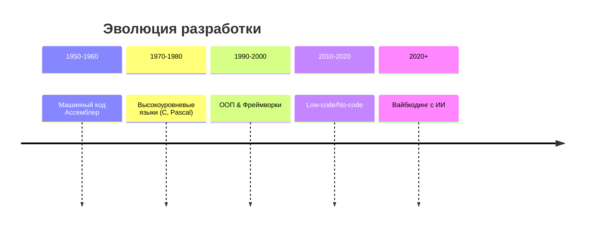

# Эволюция разработки: от машинного кода к вайбкодингу

## Как мы пришли к кодированию с ИИ

<!--
Исторический контекст помогает понять, почему вайбкодинг - это естественный следующий шаг в эволюции разработки.
-->
