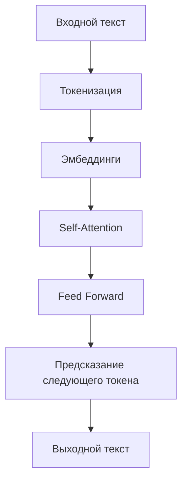

# Механика языковых моделей: как работает "магия"

## Архитектура Transformer

**Ключевые компоненты:**
- 🧩 **Токенизация** - разбиение текста на части
- 📊 **Эмбеддинги** - векторные представления слов
- 👁️ **Self-Attention** - взвешивание важности разных частей контекста
- 🧠 **Feed Forward** - нелинейные преобразования

<!--
Понимание базовой механики помогает осознать ограничения и возможности языковых моделей.
-->
